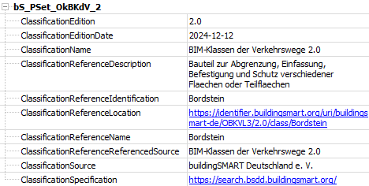
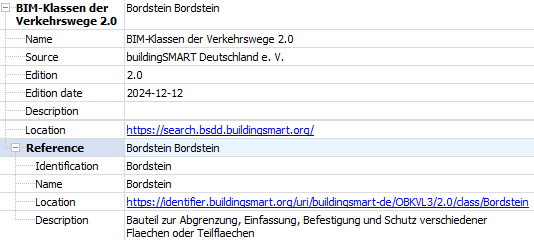

# Convert between IfcPropertySet and IfcClassification
## Supported IFC versions
- 2x3
- 4
- 4.3

## Description
Since not every software can export external classifications as IfcClassification and IfcClassificationReference, this tool shall help to improve IFC files.
The catalog and classification attributes can be added as IfcPropertySingleValues to an IfcPropertySet, which is attached to entities. This tool reads the IfcPropertySets and converts them to IfcClassification and IfcClassificationReference, which are also attached to the entities. Then the IfcPropertySet and IfcPropertySingleValues are deleted. This conversion can also be done in the other direction, if some software could not read IfcClassification.

The IfcPropertySet should look like this:

The IfcClassification with IfcClassificationReference then looks like this:

The PropertySet names can be chosen from a list of all IfcPropertySets in the file or entered as a string. From the IfcClassificationReference, a IfcPropertySet name can be generated from the buildingSMART URI of the element, if set. The schema is 'bSD_catalogCode_catalogVersion'. Otherwise it is generated as 'bSD_className' or the user enters a name. 
A new file is created as result of the conversion.

## Attributes
The following attributes are allowed and supported:
|attribute|description|required|IFC 2x3|IFC 4 and 4.3|comments|
|:----|:----:|:----:|:----:|:----:|----:|
|ClassificationSource|Source (or publisher) for this classification.||x|x||
|ClassificationEdition|The edition or version of the classification system from which the classification notation is derived.||x|x||
|ClassificationEditionDate|The date on which the edition of the classification used became valid.||x|x||
|ClassificationName|The name or label by which the classification used is normally known.|x|x|x||
|ClassificationDescription|Additional description provided for the classification.|||x||
|ClassificationLocation|Resource identifier or locator, provided as URI, URN or URL, of the classification.|||x|in IFC 4.3 used by Specification|
|ClassificationReferenceTokens|The delimiter tokens that are used to mark the boundaries of individual facets (substrings) in a classification reference.|||x||
|ClassificationReferenceLocation|Location, where the external source (classification, document or library) can be accessed by electronic means. The electronic location is provided as an URI, and would normally be given as an URL location string.||x|x||
|ClassificationReferenceIdentification|The Identification provides a unique identifier of the referenced item within the external source (classification, document or library). It may be provided as * a key, e.g. a classification notation, like NF2.3 * a handle * a uuid or guid. ...||x|x|in IFC 2x3 used by ItemReference|
|ClassificationReferenceName|Name to further specify the reference. It can provide a human readable identifier. ...|x|x|x||
|ClassificationReferenceReferencedSource|The classification system or source that is referenced.||x|x|has to be the exact name of the catalog for a correct assignment|
|ClassificationReferenceDescription|Description of the classification reference for informational purposes.|||x||
|ClassificationReferenceSort|Optional identifier to sort the set of classification references within the referenced source (either a classification facet of higher level, or the classification system itself).|||x||

## Evolution of elements IfcClassification, IfcClassificationReference and IfcRelAssociatesClassification in different versions
CHANGES to older version are marked in bold 

### IFC 2x3:  
IfcClassification(  
    Source: IfcLabel,   
    Edition: IfcLabel,   
    EditionDate: OPTIONAL IfcCalendarDate,   
    Name: IfcLabel  
)   
IfcClassificationReference(  
    Location: OPTIONAL IfcLabel,   
    ItemReference: OPTIONAL IfcIdentifier,  
    Name: OPTIONAL IfcLabel,   
    ReferencedSource: OPTIONAL IfcClassification  
)  
IfcRelAssociatesClassification(  
    IfcRoot ...,  
    RelatedObjects: Set of IfcRoot,  
    RelatingClassification: IfcClassificationNotationSelect -> relevant: IfcClassificationReference  
)   
  
### IFC 4:  
IfcClassification(  
    Source: **OPTIONAL** IfcLabel,   
    Edition: **OPTIONAL** IfcLabel,   
    EditionDate: OPTIONAL **IfcDate**,  
    Name: IfcLabel,  
    **Description: OPTIONAL IfcText,**  
    **Location: OPTIONAL IfcURIReference,**  
    **ReferenceTokens: OPTIONAL List of IfcIdentifier**  
)  
IfcClassificationReference(  
    Location: OPTIONAL **IfcURIReference**,  
    **Identification**: OPTIONAL IfcIdentifier,  
    Name: OPTIONAL IfcLabel,  
    ReferencedSource: OPTIONAL,  **IfcClassificationReferenceSelect**,  
    **Description: OPTIONAL IfcText,**  
    **Sort: OPTIONAL IfcIdentifier**  
)
IfcRelAssociatesClassification(  
    IfcRoot ...,  
    RelatedObjects: Set of **IfcDefinitionSelect**,  
    RelatingClassification: **IfcClassificationSelect -> IfcClassificationReference, IfcClassification**  
)  

### IFC 4.3:  
IfcClassification(  
    Source: OPTIONAL IfcLabel,  
    Edition: OPTIONAL IfcLabel,  
    EditionDate: OPTIONAL IfcDate,  
    Name: IfcLabel,  
    Description: OPTIONAL IfcText,  
    **Specification**: OPTIONAL IfcURIReference,  
    ReferenceTokens: OPTIONAL List of IfcIdentifier  
)  
IfcClassificationReference(  
    Location: OPTIONAL IfcURIReference,  
    Identification: OPTIONAL IfcIdentifier,  
    Name: OPTIONAL IfcLabel,  
    ReferencedSource: OPTIONAL  IfcClassificationReferenceSelect,  
    Description: OPTIONAL IfcText,  
    Sort: OPTIONAL IfcIdentifier  
)  

